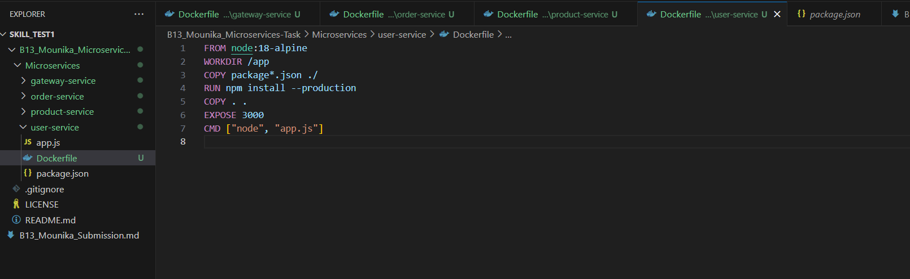
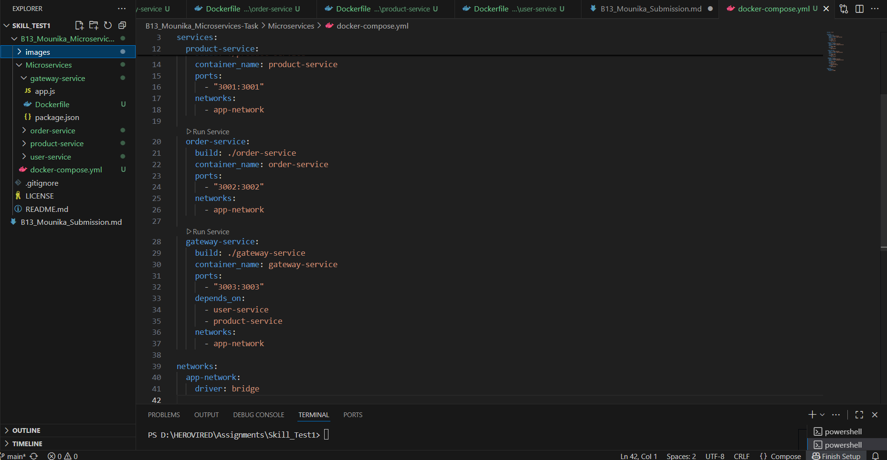

Steps for the completion of the task : 

Step1 :
As we have 3 services that need to run, we first need to create the Dockerfile in each of the respective folders

As shown in the below screenshot, I have created a Dockerfile in gateway-services and added the below commands

FROM node:18-alpine -> this command says to pull the image node with the tag 18-apline (so it's a alpine with with node installed).
WORKDIR /app        -> this command will set the working directory for the subsequent commands
COPY package*.json ./ -> this will copy the respective folder package.json files to the app directory in the container
RUN npm install --production -> this installs the required node modules defined in package.json file 
COPY . .  -> copying the local files to the working directory path.
EXPOSE 3000 -> defining the port for the running the application inside the container
CMD ["node", "app.js"] -> command to run the application

Step2:

similarly create the dockerfile all the remaining services, with the given port 

Step 3:

Create the docker-compose.yml file 

In the docker-compose.yml file 
we are defining the 4 services which are order, user, gateway and product services.
and all of them are on same isolated network named "app-network"

